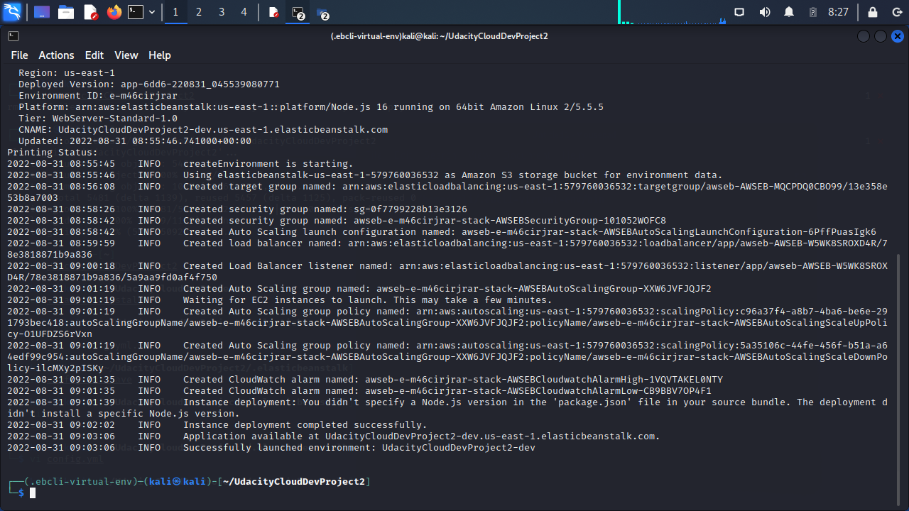

# Udagram Image Filtering Microservice

Udagram is a simple cloud application developed alongside the Udacity Cloud Engineering Nanodegree. It allows users to register and log into a web client, post photos to the feed, and process photos using an image filtering microservice.

### Screenshots:

1. Local NPM Run

2. Postman Local Environment

3. Successful request

4.  Errors

5.  Elastic Beanstalk Deployment

### Endpoint URL:
1.  [Endpoint Url](http://udacityclouddevproject2-dev.us-east-1.elasticbeanstalk.com/)
2.  [Endpoint Url + Sample image link](http://udacityclouddevproject2-dev.us-east-1.elasticbeanstalk.com/filteredimage?image_url=https://cdn.pixabay.com/photo/2015/04/23/22/00/tree-736885__480.jpg)